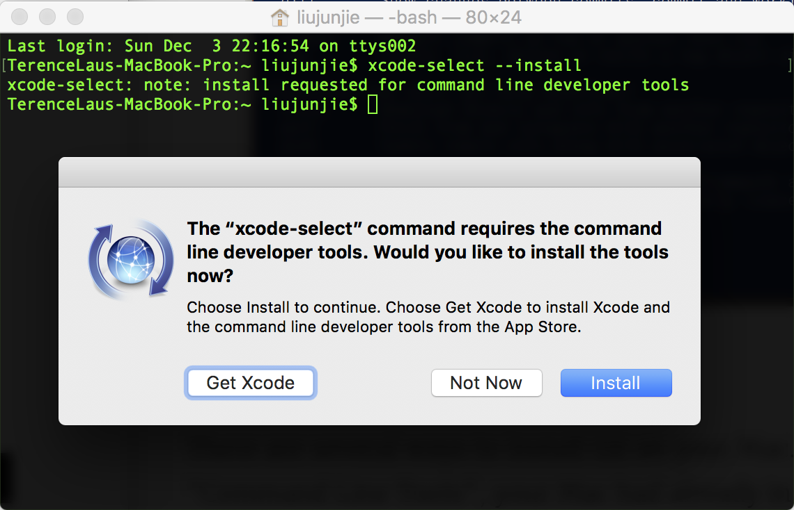
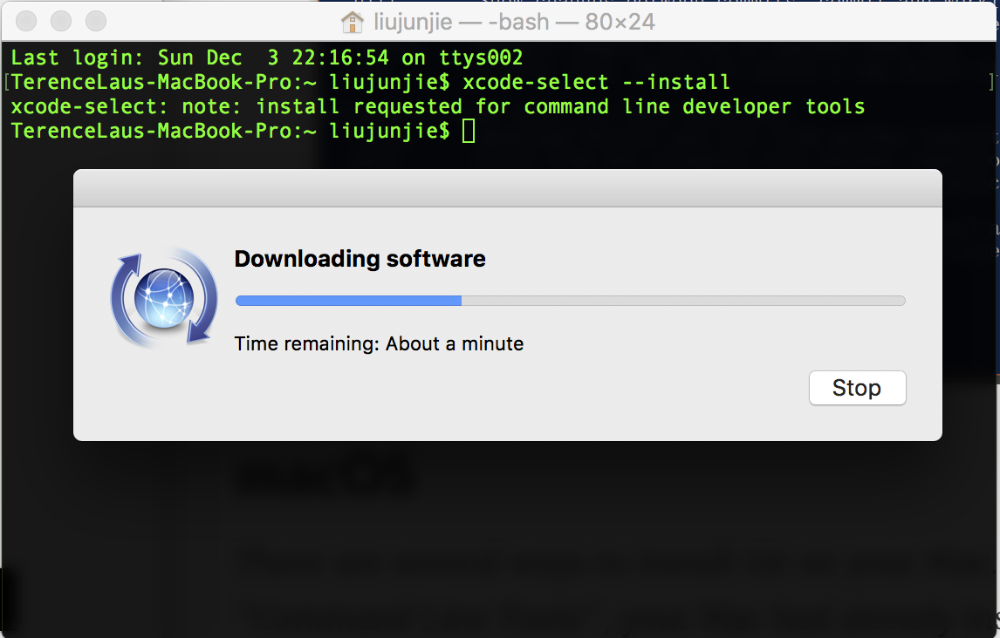
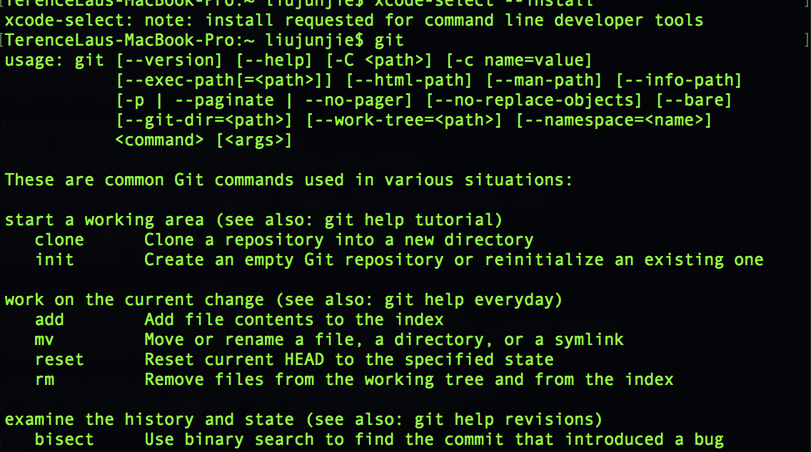
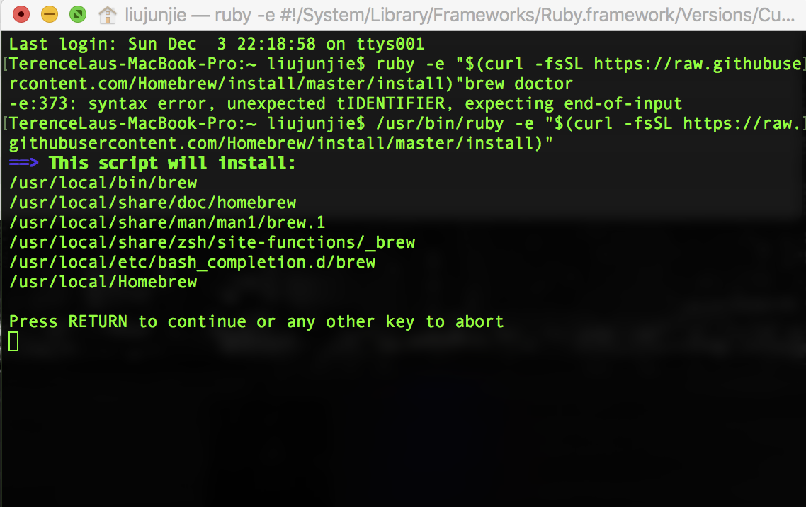
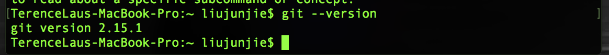

# Installation Guide

## Check your installation

**BEFORE YOU CAN GO ON**

Check your computer whether your computer has already installed Git or not by typing `git --version`  in Windows Command Prompt, Windows Powershell, or Terminal.

* If you have installed Git, you will received something like:

  ```shell
  $ git version 2.15.1.windows.2
  ```

  Then, you can ignore this installation guide.

* If you did not receive this information, please continue.

## Windows

If you are in Windows, please refer to the following steps.

1. Download `Git for Windows` from https://git-scm.com/, remember to select a **setup**.

   

2. Install `Git for Windows` using default settings. Remember to select "Use Git from the Windows Command Prompt"

   

3. Now you can directly use Git commands in Command Prompt or Powershell.

   

## macOS

There are several ways to install Git on your Mac. If you have installed the Xcode or its "Command Line Tools", your Mac had already installed the Git; 

- Use Xcode to install Git.

  *Xcode is anintergrated development environment (IDE) for macOS containing a suite of software development tools developed by Apple*

  1. Open a terminal and enter `xcode-select --install`

  

  1. click the install button and it starts to install Xcode command line tools 

     

  2. After the installation you can find the git by enter `git` in a terminal

     

  ​

- Use Homebrew to install git

  <font size=1>*Homebrew is a very powerful package manager for macOS; Homebrew […] simplifies the installation of software on the Mac OS X operating system.*</font>

  1. Install **Hombrew**

     - **Copy & paste the following** into the terminal window and **hit Return**

       `/usr/bin/ruby -e "$(curl -fsSL https://raw.githubusercontent.com/Homebrew/install/master/install)"`

       

       You will be offtered to install the Command Line Developer Tools from Apple. ***Confirm by clicking Install***. After the installation finished.continue the installation of Homebrew by **hitting Return** again.

  2. Install **Git**

     - **Copy & paster the following** into the terminal and **hit Return**

       ` brew install git`

       Now, You get Git and can use it !

       

## Linux

If you are in Linux, you can directly install Git by package management software.

```shell
# Debian/Ubuntu
sudo apt update
sudo apt install git
# Fedora/CentOS
sudo yum makecache
sudo yum install git
```
## Check your installation

After finished above steps, check your installation success or not by typing `git --version` in Windows Command Prompt, Windows Powershell or Terminal.

* If you receive something like:

  ```shell
  $ git version 2.15.1.windows.2
  ```

  That means you have successfully installed Git.

* If you didn't receive that, please check your installation or contact the author for help.