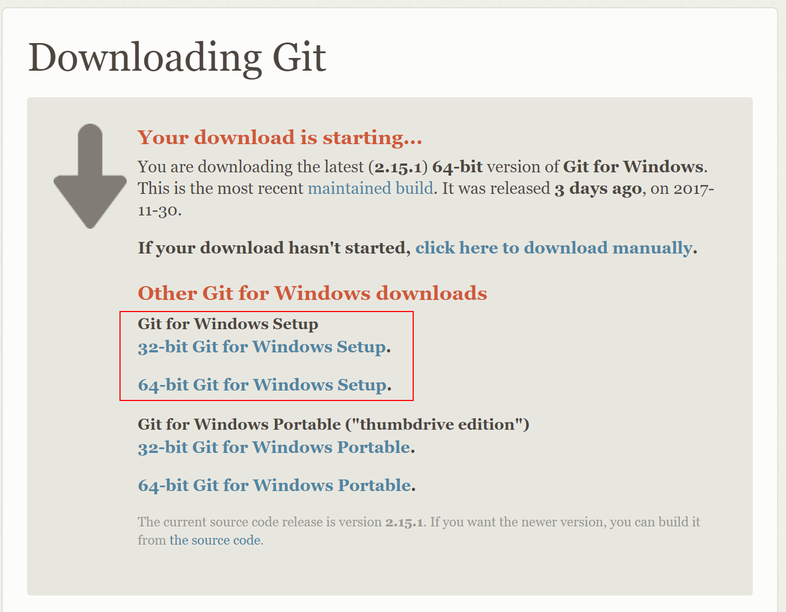
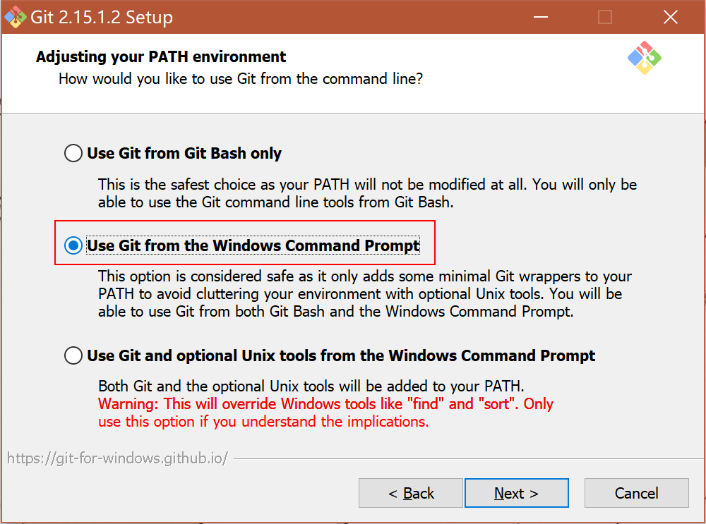
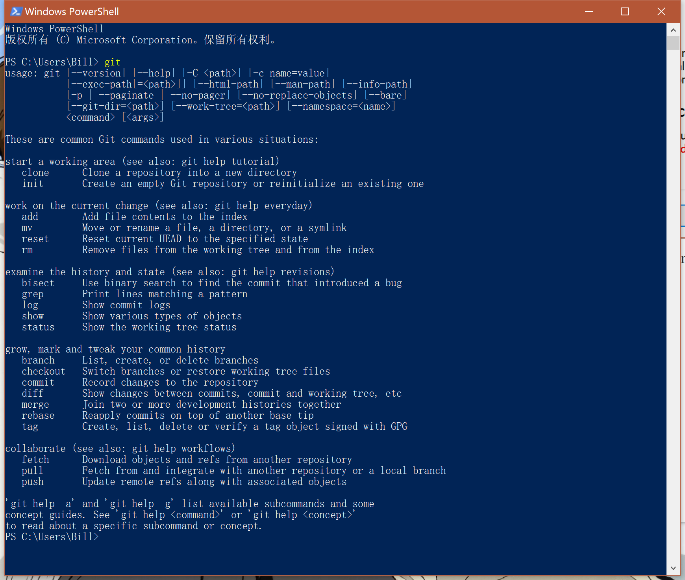

# Installation Guide

## Windows

If you are in Windows, please refer to the following steps.

1. Download `Git for Windows` from https://git-scm.com/, remember to select a **setup**.

   

2. Install `Git for Windows` using default settings. Remember to select "Use Git from the Windows Command Prompt"

   

3. Now you can directly use Git commands in Command Prompt or Powershell.

   

## macOS

## Linux

If you are in Linux, you can directly install Git by package management software.

```shell
# Debian/Ubuntu
sudo apt update
sudo apt install git
# Fedora/CentOS
sudo yum makecache
sudo yum install git
```